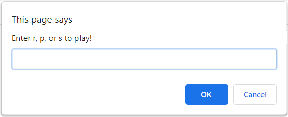

# JS-Rock-Paper-Scissors

Simple Rock Paper Scissors JavaScript Game

<!-- Live link to deployed app -->

Repository: https://github.com/Mdudzik92/JS-Rock-Paper-Scissors 
Deployed app: https://mdudzik92.github.io/JS-Rock-Paper-Scissors/

<!-- Technologies used -->

JavaScript, HTML

<!-- Explanation of what the app is -->

This is a simple Rock Paper Scissors game created with inline JavaScript on a blank HTML page. The user simply follows the instructions they are given in alert boxes until they have reached ten rounds against the computer, and then they are given their score.

<!-- Screenshot -->

<!-- License -->

MIT

<!-- Contact information -->

Email: mdudzik92@gmail.com
